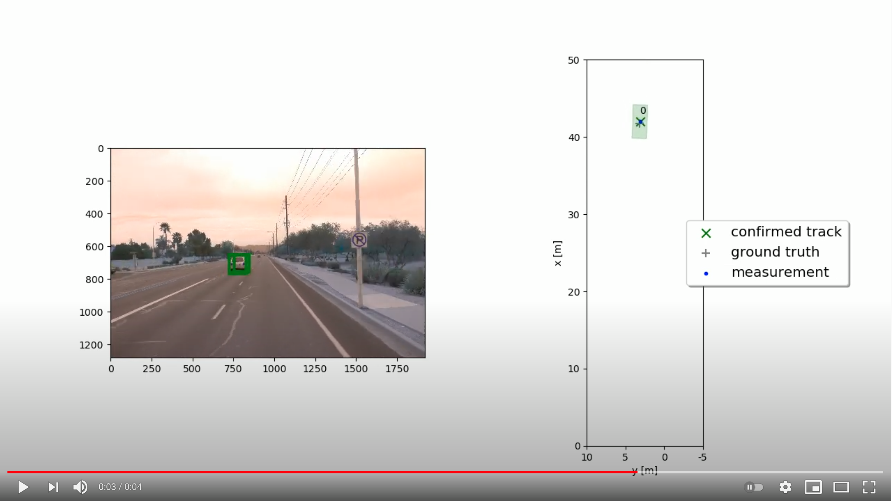
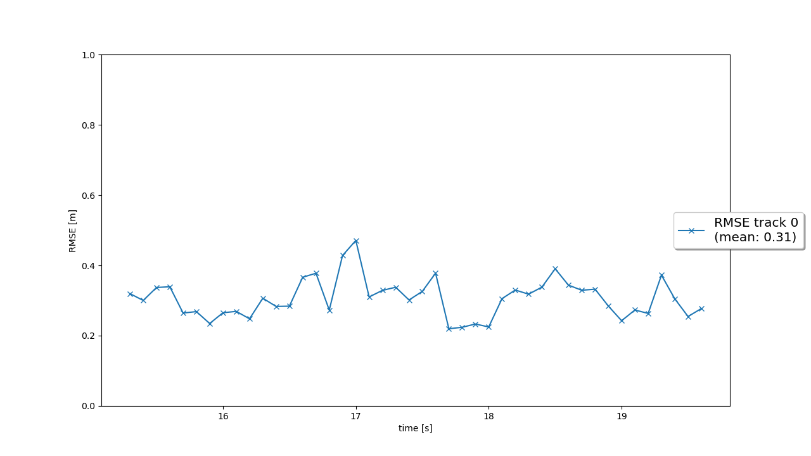
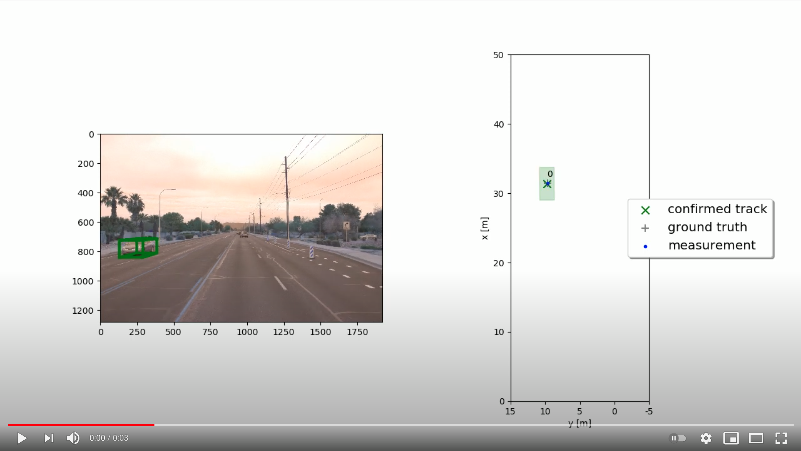
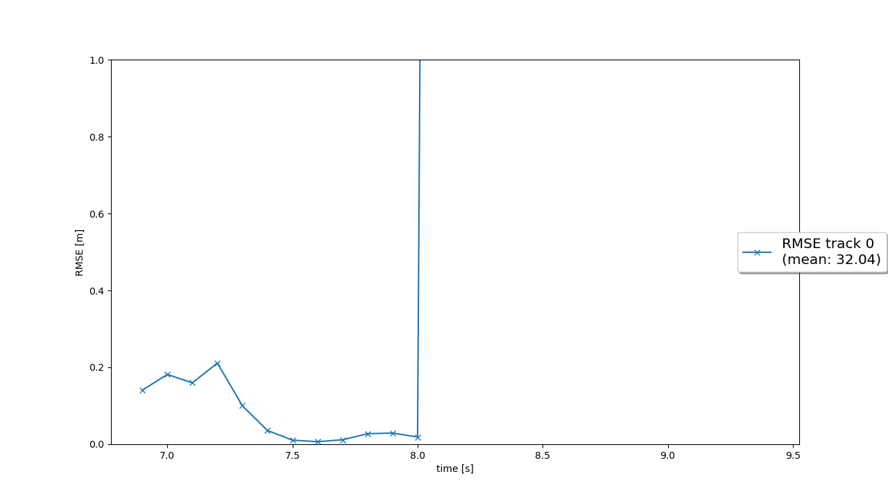
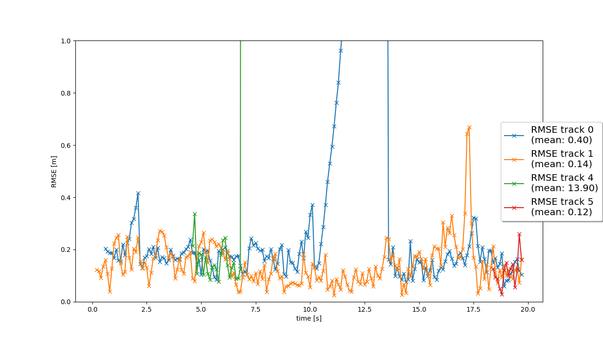
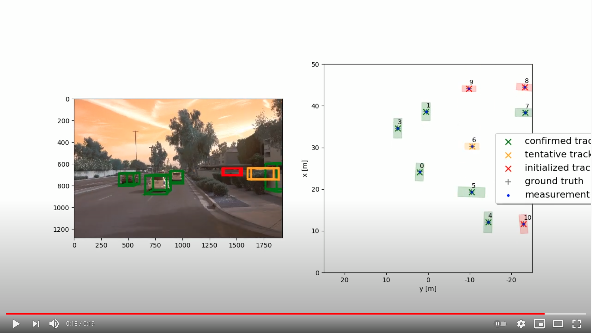
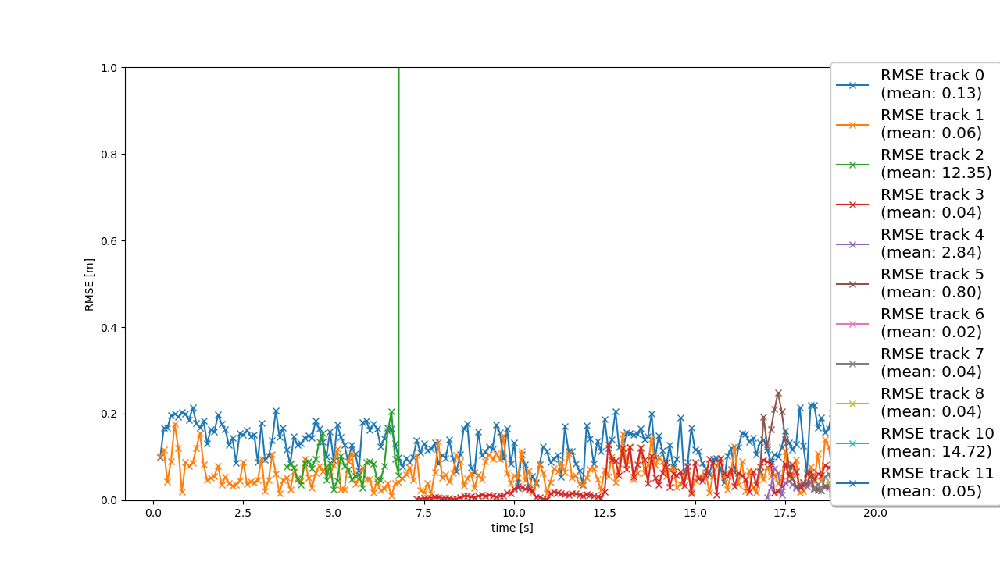

# Sensor Fusion and Object Tracking
Self-Driving Car Engineer Nanodegree 
https://www.udacity.com/course/self-driving-car-engineer-nanodegree--nd013

## Installation Instructions

Download or clone this github repository with the starter code:
https://github.com/udacity/nd013-c2-fusion-starter

Follow all the installation instructions in the github repository:
https://github.com/udacity/nd013-c2-fusion-starter#installation-instructions-for-running-locally

Basically, you need to install Python 3.7 and all the requirements in the file `requirements.txt` by typing this command in the terminal: `pip3 install -r requirements.txt`.

Additionally, you need to download and install the "Waymo Open Dataset Files" and the Pre-Trained Models for `darknet` <https://drive.google.com/file/d/1Pqx7sShlqKSGmvshTYbNDcUEYyZwfn3A/view?usp=sharing> and `fpn_resnet` <https://drive.google.com/file/d/1RcEfUIF1pzDZco8PJkZ10OL-wLL2usEj/view?usp=sharing>. Once downloaded, please copy the model files into the paths `/tools/objdet_models/darknet/pretrained` and `/tools/objdet_models/fpn_resnet/pretrained respectively`.

Moreover, download the precomputed results for `darknet` and `fpn_resnet` in this link <https://drive.google.com/drive/folders/1-s46dKSrtx8rrNwnObGbly2nO3i4D7r7?usp=sharing>. And then unzip them into the folder `/results`.

Once you completed the first steps to install this project, it is time to download the following files and to copy them in the following directories:

| FILES TO COPY | DIRECTORIES |
| ------------- | -------------|
| `loop_over_dataset_f4.py` | `/` |
| `/student/association.py` | `/student/` |
| `/student/filter.py` | `/student/` |
| `/student/measurements.py` | `/student/` |
| `/student/objdet_detect.py` | `/student/` |
| `/student/trackmanagement.py` | `/student/` |

Note: The directory `/` is relative to this project's directory.

Now that you have successfully installed this project, you can run it by using this command `python loop_over_dataset_f4.py`.

## Questions to Answer

### Write a short recap of the four tracking steps and what you implemented there (EKF, track management, data association, camera-lidar sensor fusion). Which results did you achieve? Which part of the project was most difficult for you to complete, and why?

**Step 1. Extended Kalman Filter (EKF):** I implemented a complete Kalman filter with 6 dimensions: 3 dimensions for the position (x, y, z) and 3 dimensions for the velocity (vx, vy, vz). According to Prof. Thrun, this is a great achievement because it is the most important part of a tracking system with sensor fusion support. It was difficult for me to know when to use `H * x` and when to use `hx`. The later `hx` is only used when computing gamma and when computing the Mahalanobis Distance (MHD). And I spent a lot of time tuning the 6 x 6 matrixes returned by `P()` and `Q()`. I think I found an almost optimal configuration for this project.

**Step 2. Track Management:**

**Step 3. Data Association:**

**Step 4. Camera-Lidar Sensor Fusion:** This is the final step to complete the whole sensor fusion system. Coordinates from 2 different sensors with different geometries are transformed into vehicle coordinates by using the homogeneous transformation matrices. In like manner, vehicle coordinates are transformed into the corresponding sensor coordinates in order to compute `hx` and the EKF's Jacobian. In this step, I was confused about how to activate the camera measurements. Because they were not active in spite of following the instructions correctly. I searched for all the conditional statements like `if sensor.name == 'lidar':` and I changed them to `if sensor.name in ['lidar', 'camera']:` with disastrous results. Finally, I noticed that such changes were not necessary. Because I forgot to use `hx` when computing the Mahalanobis Distance (MHD). Using `H * x` when computing MHD led to discarding all camera measurements.

For me, the most difficult part of the project was to fully understand the overall structure of the project. In addition to completing all the TODOs, I also needed to read the source code of all the Python files in all the project. Because the TODOs asked me to do many things that were confusing and ambiguous. I didn't know how to complete many TODOs. And by reading and understanding all the source files, I finally completed the project. The real problem is this project has many mutually interacting parts. And if you program one part in a wrong way, all the project fails. So, it's very demotivating to see that nothing in this project works well. So, I printed and printed all the intermediate results, validating that everything is well programmed as intended. In this way, I got everything correct and now the project finally works.
    
### Do you see any benefits in camera-lidar fusion compared to lidar-only tracking (in theory and in your concrete results)?
    
### Which challenges will a sensor fusion system face in real-life scenarios? Did you see any of these challenges in the project?

### Can you think of ways to improve your tracking results in the future?

## Results

**[SDCE ND] Sensor Fusion and Object Tracking (Step 1)** 
https://youtu.be/slhJJ3BBzGA 

**RMSE through time (Step 1)** 

**[SDCE ND] Sensor Fusion and Object Tracking (Step 2)** 
https://youtu.be/yj8v9OILTUo 

**RMSE through time (Step 2)** 

**RMSE through time (Step 3)** 

**[SDCE ND] Sensor Fusion and Object Tracking (Step 4)** 
https://youtu.be/ZWA0pGVKmP8 

**RMSE through time (Step 4)** 

**[SDCE ND] Sensor Fusion and Object Tracking (Step 4 with ground-truth labels)** 
https://youtu.be/DfNAdwFrbcE 

**RMSE through time (Step 4 with ground-truth labels)** 

