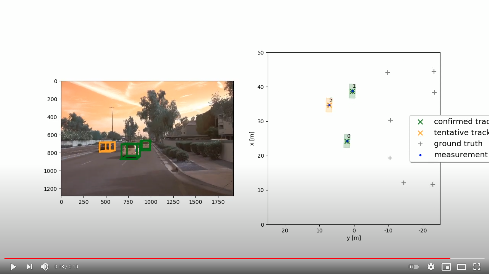

# Sensor Fusion and Object Tracking
Self-Driving Car Engineer Nanodegree 
https://www.udacity.com/course/self-driving-car-engineer-nanodegree--nd013

**[SDCE ND] Sensor Fusion and Object Tracking (Step 2)** 
https://youtu.be/yj8v9OILTUo 

**[SDCE ND] Sensor Fusion and Object Tracking (Step 4 with ground-truth labels)** 
https://youtu.be/DfNAdwFrbcE 

**[SDCE ND] Sensor Fusion and Object Tracking (Step 4)** 
https://youtu.be/ZWA0pGVKmP8 

## Write a short recap of the four tracking steps and what you implemented there (EKF, track management, data association, camera-lidar sensor fusion). Which results did you achieve? Which part of the project was most difficult for you to complete, and why?
    
# Do you see any benefits in camera-lidar fusion compared to lidar-only tracking (in theory and in your concrete results)?
    
# Which challenges will a sensor fusion system face in real-life scenarios? Did you see any of these challenges in the project?

# Can you think of ways to improve your tracking results in the future?
